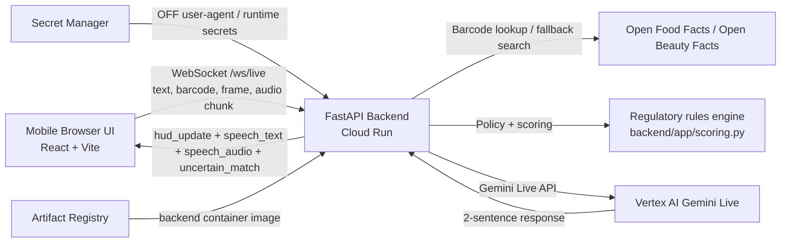

# NutriVision Live

NutriVision Live is a realtime multimodal shopping copilot (camera + voice + HUD) for the Gemini Live Agent Challenge (Live Agent track).

## Hackathon Requirement Mapping

- Gemini model used: Gemini Live API via Google GenAI SDK (`backend/app/main.py`)
  - Vertex default: `gemini-live-2.5-flash-native-audio`
  - API-key default: `gemini-2.5-flash-native-audio-preview-12-2025`
  - Native audio relay path: backend emits `speech_audio` for frontend playback with text fallback
- SDK requirement: `google-genai` declared in `backend/requirements.txt`
- Google Cloud service usage:
  - Cloud Run
  - Vertex AI API
  - Secret Manager
  - Artifact Registry
  - Terraform IaC in `infra/terraform`

## Architecture Diagram



## Repository Layout

- `start.md`: primary project entrypoint
- `project_management/`: requirement baseline, execution status, checklist
- `backend/`: FastAPI websocket backend + Gemini integration + tests
- `frontend/`: mobile-first React UI
- `infra/terraform/`: Google Cloud infrastructure automation
- `docs/testing/`: backend/frontend/terraform verification guides

## Local Run (Reproducible)

### 1) Backend

```bash
cd backend
python3 -m venv .venv
source .venv/bin/activate
pip install -r requirements.txt pytest
export GEMINI_USE_VERTEX=false
export GEMINI_API_KEY=YOUR_KEY_IF_NOT_USING_VERTEX
uvicorn app.main:app --host 0.0.0.0 --port 8000 --reload
```

### 2) Frontend

```bash
cd frontend
npm install
# optional, required when backend is not same origin
export VITE_BACKEND_WS_URL=ws://localhost:8000/ws/live
npm run dev
```

## Cloud Deployment (Google Cloud)

Full guide: `docs/terraform-deployment.md`

Cost profile in default `terraform.tfvars`:
- Backend Cloud Run scales to zero (`min_instances=0`)
- Backend capped at `max_instances=1`
- Optional project budget alert support (`monthly_budget_amount_usd=300`, off by default)
- Optional frontend Cloud Run deployment (off by default)

Quick path:

```bash
export PROJECT_ID="light-client-488312-r3"
cd infra/terraform/bootstrap
terraform init
terraform apply -var="project_id=$PROJECT_ID" -var="state_bucket_name=YOUR_UNIQUE_BUCKET"

cd ../environments/prod
cp backend.hcl.example backend.hcl
# set bucket in backend.hcl
terraform init -backend-config=backend.hcl
terraform apply -var-file=terraform.tfvars \
  -target=module.project_apis \
  -target=module.runtime_service_account \
  -target=module.artifact_registry \
  -target=module.secret_manager

cd ../../../../backend
gcloud auth configure-docker europe-west3-docker.pkg.dev
gcloud builds submit --tag europe-west3-docker.pkg.dev/$PROJECT_ID/nutrivision-backend/backend:latest

cd ../infra/terraform/environments/prod
export TF_VAR_secret_payloads='{"off_user_agent":"NutriVisionLive/0.1 (contact: you@example.com)"}'
terraform apply -var-file=terraform.tfvars
```

Best-practice auth:
- Prefer Vertex mode (`GEMINI_USE_VERTEX=true`) with service account IAM.
- Use Gemini API key mode only if needed, and only through Secret Manager (`gemini_api_key`).

Optional frontend Cloud Run deploy:
```bash
cd frontend
gcloud auth configure-docker europe-west3-docker.pkg.dev
docker build \
  --build-arg VITE_BACKEND_WS_URL=wss://REPLACE_WITH_BACKEND_HOST/ws/live \
  -t europe-west3-docker.pkg.dev/$PROJECT_ID/nutrivision-backend/frontend:latest \
  .
docker push europe-west3-docker.pkg.dev/$PROJECT_ID/nutrivision-backend/frontend:latest
```

Cloud proof check:

```bash
cd infra/terraform/environments/prod
URI=$(terraform output -raw cloud_run_service_uri)
echo "$URI"
curl "$URI/health"
```

## Validation

### Backend tests

```bash
cd backend
source .venv/bin/activate
pytest -q
```

### Frontend production build

```bash
cd frontend
npm run build
```
